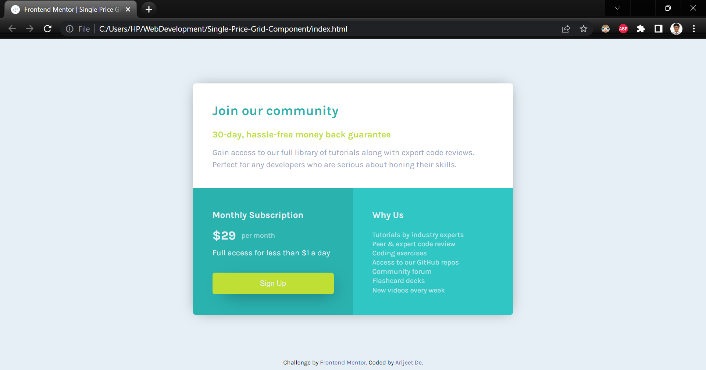

# Frontend Mentor - Single price grid component solution

This is a solution to the [Single price grid component challenge on Frontend Mentor](https://www.frontendmentor.io/challenges/single-price-grid-component-5ce41129d0ff452fec5abbbc). Frontend Mentor challenges help you improve your coding skills by building realistic projects. 

## Table of contents

- [Overview](#overview)
  - [The challenge](#the-challenge)
  - [Screenshot](#screenshot)
  - [Links](#links)
- [My process](#my-process)
  - [Built with](#built-with)
  - [What I learned](#what-i-learned)
  - [Continued development](#continued-development)
  - [Useful resources](#useful-resources)
- [Author](#author)
- [Acknowledgments](#acknowledgments)

## Overview

### The challenge

Users should be able to:

- View the optimal layout for the component depending on their device's screen size
- See a hover state on desktop for the Sign Up call-to-action

### Screenshot

### Links

- Solution URL: [Add solution URL here](https://github.com/debroglie27/SinglePriceGridComponent)
- Live Site URL: [Add live site URL here](https://your-live-site-url.com)

## My process

### Built with

- Semantic HTML5 markup
- CSS custom properties
- Flexbox
- Mobile-first workflow

### What I learned

I learned how to use div tags properly and got introduced to Flexbox. Moreover, I understood css breakpoints to design the site according to screen size.

### Continued development

I want to focus on CSS Grid because because it goes hand-in-hand with CSS Grid.

### Useful resources

- [YouTube Video](https://www.youtube.com/watch?v=zJSY8tbf_ys&list=WL&index=11&t=68427s) - This helped me getting started. I really liked this tutorial especially the Flexbox part.
- [Box-Shadow-Generator](https://cssgenerator.org/box-shadow-css-generator.html) - This helped me on generating Box Shadows.
- [Button-Generator](https://css3buttongenerator.com/) - This helped me on generating Stylish Buttons.

## Author

- GitHub - [@debroglie27](https://github.com/debroglie27)
- Frontend Mentor - [@debroglie27](https://www.frontendmentor.io/profile/debroglie27)
- Facebook - [@arijeet.de](https://www.facebook.com/arijeet.de)
- instagram - [@121debroglie](https://www.instagram.com/121debroglie/)

## Acknowledgments

This is where you can give a hat tip to anyone who helped you out on this project. Perhaps you worked in a team or got some inspiration from someone else's solution. This is the perfect place to give them some credit.